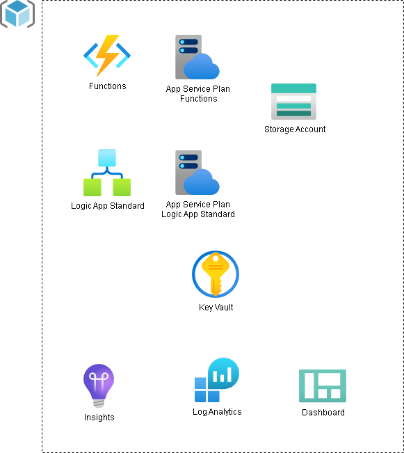
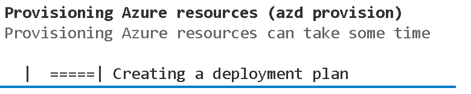
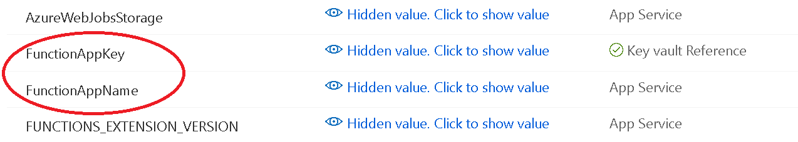

# Logic App Standard and Functions. The perfect couple.
## "With or without private endpoints"

Logic App Standard is Microsoft's low code offering for implementing enterprise integrations. It offers [**Connectors**](https://learn.microsoft.com/en-us/azure/connectors/built-in) which can save you time from building everything yourself.
Azure Functions provide custom coding and more advanced data processing/mapping functionality. In advanced integration scenario's they are typically used together. 

This templates includes a Logic App Standard and Functions deployment. And can be used with or without private endpoint setup.

### Application architecture



This template utilizes the following Azure resources:

- [**Azure Logic App Standard**](https://docs.microsoft.com/azure/logic-app-standard/) to design the workflows
- [**Azure Function Apps**](https://docs.microsoft.com/azure/azure-functions/) to host the custom code
- [**Azure Monitor**](https://docs.microsoft.com/azure/azure-monitor/) for monitoring and logging
- [**Azure Key Vault**](https://docs.microsoft.com/azure/key-vault/) for securing secrets


### How to get started

1. Install Visual Studio Code with Azure Logic Apps (Standard) and Azure Functions extensions
1. Create a new folder and switch to it in the Terminal tab
1. Run `azd login`
1. Run `azd init -t https://github.com/marnixcox/logicapp-standard-func`

Now the magic happens. The template contents will be downloaded into your project folder. This will be the next starting point for building your integrations.

### Contents

The following folder structure is created. Where `corelocal` is added to extend the standard set of core infra files.

```
├── infra                      [ Infrastructure As Code files ]
│   ├── main.bicep             [ Main infrastructure file ]
│   ├── main.parameters.json   [ Parameters file ]
│   ├── app                    [ Infra files specifically added for this template ]
│   ├── core                   [ Full set of infra files provided by AzdCli team ]
│   └── corelocal              [ Extension on original core files to enable private endpoint functionality ]
├── src                        [ Application code ]
│   ├── functions              [ Azure Functions ]
│   └── workflows              [ Azure Logic App Standard ]
└── azure.yaml                 [ Describes the app and type of Azure resources ]

```

### Provision Infrastructure 

Let's first provision the infra components. 

- Run `azd provision`

First time an environment name, subscription and location need to be selected. These will then be stored in the `.azure` folder.


Resource group and all components will be created.



### Deploy Contents 

After coding some functions and creating Azure Logic App Standard workflows these can be deployed with another single command.

- Run `azd deploy`

Functions code and workflows will be deployed into the existing infra components.


### Connections

Both Logic App Standard and Functions are granted access to the Key Vault.

In order to setup the Function Connections in the [**connections.json**](https://learn.microsoft.com/en-us/azure/logic-apps/devops-deployment-single-tenant-azure-logic-apps) file the following parameters are available in the Logic App Standard instance:

`FunctionAppKey`
`FunctionAppName`




