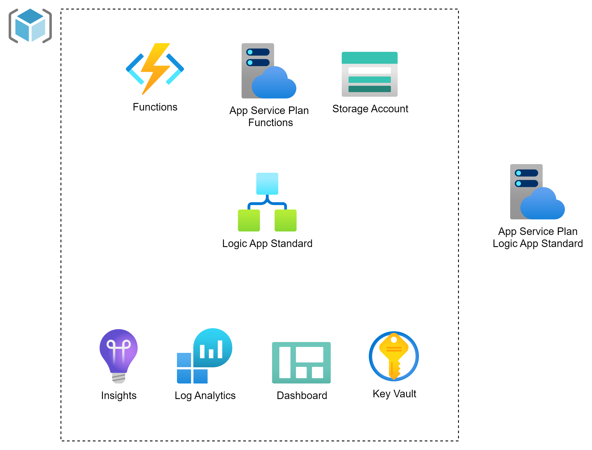

# Logic App Standard and Functions
### template to deploy application integrations

Logic App Standard is Microsoft's low code offering for implementing enterprise integrations. It offers [**Connectors**](https://learn.microsoft.com/en-us/azure/connectors/built-in) which can save you time from building everything yourself.
Azure Functions provide custom coding and more advanced data processing/mapping functionality. In advanced integration scenario's they are typically used together. 

This templates includes a Logic App Standard and Functions deployment. 

It needs to be used together with an [**integration-hub**](https://github.com/marnixcox/integration-hub/) which hosts the Logic App Standard Plan and deploys the Azure Artifact libraries.

### Application architecture



This template utilizes the following Azure resources:

- [**Azure Logic App Standard**](https://learn.microsoft.com/azure/logic-apps/) to design the workflows
- [**Azure Function Apps**](https://docs.microsoft.com/azure/azure-functions/) to host the custom code
- [**Azure Monitor**](https://docs.microsoft.com/azure/azure-monitor/) for monitoring and logging
- [**Azure Key Vault**](https://docs.microsoft.com/azure/key-vault/) for securing secrets

### How to get started

1. Install Visual Studio Code with Azure Logic Apps (Standard) and Azure Functions extensions
1. Create a new folder and switch to it in the Terminal tab
1. Run `azd auth login`
1. Run `azd init -t https://github.com/marnixcox/logicapp-standard-func`

Now the magic happens. The template contents will be downloaded into your project folder. This will be the next starting point for building your integrations.

### Contents

The following folder structure is created. 

```
├── infra                      [ Infrastructure As Code files ]
│   ├── functions              [ Function files ]
│   ├── keyvault               [ Key Vault files ]
│   ├── logicapp               [ Logic app files ]
│   ├── storage                [ Storage files ]
│   ├── main.bicep             [ Main infrastructure file ]
│   └── main.parameters.json   [ Parameters file ]
├── src                        [ Application code ]
│   ├── functions              [ Azure Functions ]
│   └── workflows              [ Azure Logic App Standard ]
└── azure.yaml                 [ Describes the app and type of Azure resources ]

```

### Key Infrastructure Files
- `functions/functions.bicep` - Functions
- `functions/functions-key.bicep` - Store function app key
- `keyvault/keyvault-secret.bicep` - Store keyvault secret
- `keyvault/keyvault.bicep` - Key Vault
- `logicapp/workflows.bicep` - Logic App Standard 
- `storage/storage.bicep` - Storage account
- `main.bicep` - Main orchestration
- `monitoring.bicep` - Observability stack
- `resources.bicep` - Resource collection


### Prerequisites

- Install [**integration-hub**](https://github.com/marnixcox/integration-hub) first with the same environment name as **logicapp-standard-func**

### Provision Infrastructure 

Let's first provision the infra components. Add a `resourceToken` parameter to the `main.parameters.json` to set the application name or leave it out to have a random name generated.

```
 "resourceToken": {
      "value": "appname"
    }
```

- Run `azd provision`

First time an environment name, subscription and location need to be selected. These will then be stored in the `.azure` folder.


Resource group and all components will be created.


### Deploy Contents 

After coding some functions and creating Azure Logic App Standard workflows these can be deployed with another single command.

- Run `azd deploy`

Functions code and workflows will be deployed into the existing infra components.


### Azure Artifacts 

In order to use the NuGet libraries from your Azure Artifacts feed add the `<packageSources>` segment to the `NuGet.Config` file.

```
 <packageSources>
    <add key="Integration" value="https://pkgs.dev.azure.com/ORG_NAME/PROJECT_NAME/_packaging/FEED_NAME/nuget/v3/index.json" />
 </packageSources>

```

### Connections

Both Logic App Standard and Functions are granted access to the Key Vault.

In order to setup the Function Connections in the [**connections.json**](https://learn.microsoft.com/en-us/azure/logic-apps/devops-deployment-single-tenant-azure-logic-apps) file the following parameters are available in the Logic App Standard instance:

`FUNCTIONAPP_KEY`
`FUNCTIONAPP_NAME`


### Deployment pipelines

This template includes pipelines for a `build once, deploy everywhere` pattern. Make sure to update the `serviceConnection` and  `AZURE_SUBSCRIPTION_ID` accordingly. 

- `main.yml` - Branch trigger 
- `validate.yml` - Validate infra code
- `package.yml` - Package src code
- `provision.yml` - Provision infra
- `deploy.yml` - Deploy src


